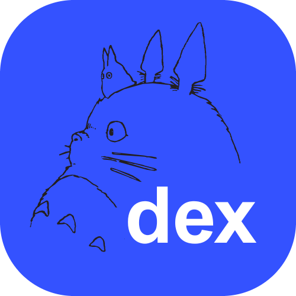
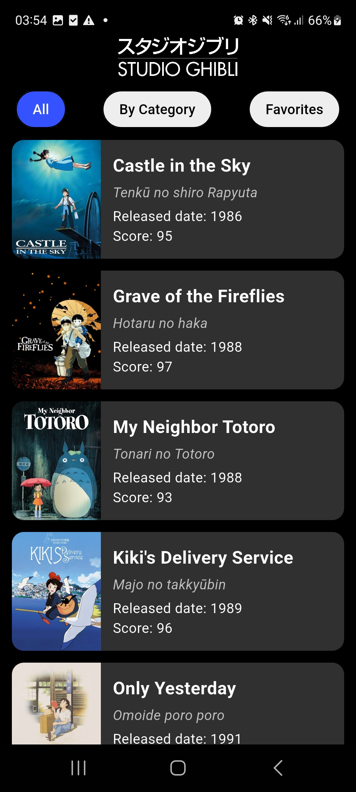
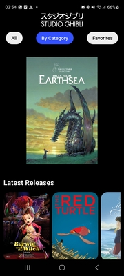
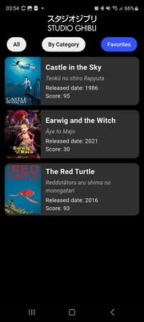
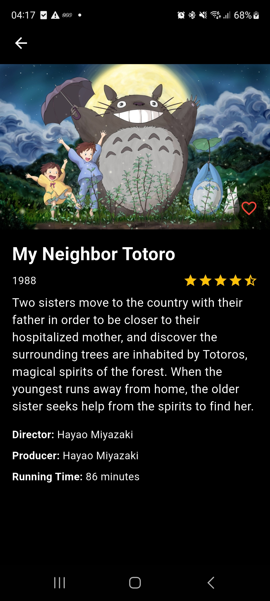

# GhibliDex



**GhibliDex** é um aplicativo de catálogo dos filmes do Studio Ghibli. Desenvolvido em Flutter, ele oferece funcionalidades como:

- Marcar filmes como favoritos  
- Filtros por categoria  
- Interface responsiva e intuitiva

O nome **GhibliDex** é inspirado na **Pokédex**, o famoso catálogo dos Pokémon. A ideia é oferecer uma experiência similar de consulta, mas voltada para o universo encantador do Studio Ghibli.

O app utiliza a [API pública do Studio Ghibli](https://ghibliapi.vercel.app/) para obter os dados dos filmes, e conta com os seguintes pacotes Flutter:

- `provider`  
- `shared_preferences`  
- `flutter_modular`

---

### Principais Telas do App

|     Tela inicial     | Filmes por categoria |  Filmes Favoritados  |
|:--------------------:|:--------------------:|:--------------------:|
|  |  | 

---

## Interface do Usuário

A interface do GhibliDex foi pensada para ser clara e funcional:

- **AppBar** com a logo centralizada do Studio Ghibli  
- **Navegação por chips** na parte superior  
- **Lista de filmes** exibida em dois modos:

### Visualização "All"
Exibe os filmes em uma lista linear com:

- Imagem do filme  
- Título  
- Detalhes principais

### Visualização por Categoria
Mostra apenas as imagens dos filmes, organizadas horizontalmente por categoria.

---

<h2>Detalhes do Filme</h2>



<div align="left">
  <p>Ao tocar em um filme, o usuário é levado para uma tela de detalhes contendo:</p>
  <ul>
    <li>Banner do filme</li>
    <li>Título</li>
    <li>Ano de lançamento</li>
    <li>Pontuação (0 a 5 estrelas)</li>
    <li>Descrição</li>
    <li>Diretor</li>
    <li>Produtor(es)</li>
    <li>Duração</li>
    <li>Botão para favoritar o filme</li>
  </ul>
  <p>Ao favoritar, um <em>toast</em> exibe a mensagem <strong>"Movie added to favorites!"</strong>, e o filme é salvo localmente em uma lista de strings (<code>favorited_movies</code>) utilizando <code>SharedPreferences</code>.</p>
</div>

---

## ⭐ Favoritos

Na aba **Favorites**, são listados todos os filmes que o usuário marcou como favoritos.

- A tela utiliza `ValueNotifier` para observar alterações na lista de favoritos e atualizá-la automaticamente.  
- O botão "Favorites" é desabilitado caso não haja filmes favoritados.  

---

## Navegação

A navegação entre telas é feita com uma função personalizada chamada `push`, que encapsula a lógica do `Navigator.push` e `Navigator.pushReplacement`, permitindo:

- Empilhar uma nova rota  
- Substituir a rota atual

  ```dart
  Future push(BuildContext context, Widget page, {bool replace = false}) async {
    if (replace) {
      Navigator.of(context).popUntil((route) => route.isFirst);
      return Navigator.pushReplacement(context,
        MaterialPageRoute(builder: (BuildContext context) => page));
    }
    return Navigator.push(context,
      MaterialPageRoute(builder: (BuildContext context) => page));
  }

---

## O que ainda pode ser melhorado

- Utilizar o **Flutter Modular** na estrutura de navegação e injeção de dependências  
- Adotar **MobX** para um gerenciamento de estado mais reativo  
- Criar e executar **testes unitários** para garantir a estabilidade da aplicação  
- Melhorar a **interface responsiva e personalizada para telas grandes**, garantindo boa usabilidade em tablets

## Como rodar o projeto

### Pré-requisitos

- Flutter SDK (versão recomendada: 3.27.2)
- Dart SDK
- Editor (VS Code, Android Studio, etc.)

### Passos

  ```bash
  git clone https://github.com/anagamplay/ghibli_dex.git
  cd ghibli_dex
  flutter pub get
  flutter run
